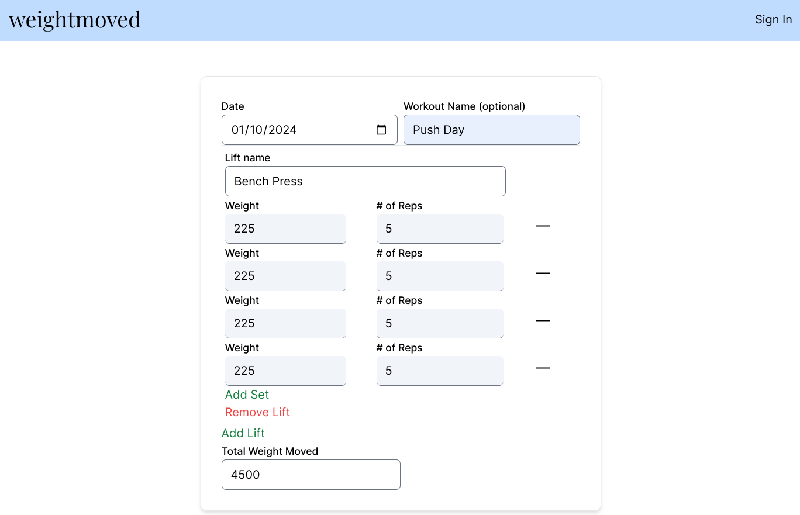

# Weight Moved

Training Volume, or weight moved, is a popular metric used to track weight lifting performance. As can be inferred from the name, weight moved is weight lifted times sets time reps. This application serves to instantly calculate the total weight moved in a workout. Users can input their workout information and the total weight moved is output in real time. Users can also create an account to save and track their workouts. 

[Click here to visit weightmoved.com](https://weightmoved.com/)

 

## Features

- Allows users to add as many lifts and sets as needed with a simple click of a button.  

- Instantly calculates the total volume of your workout without the need for additional clicks.  

- Save and store your workouts in a dedicated workout log for future reference.  